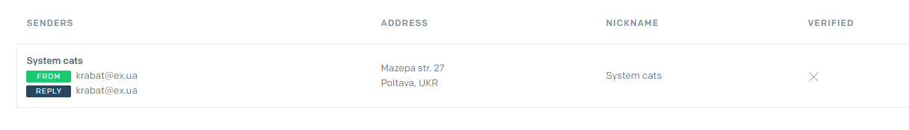
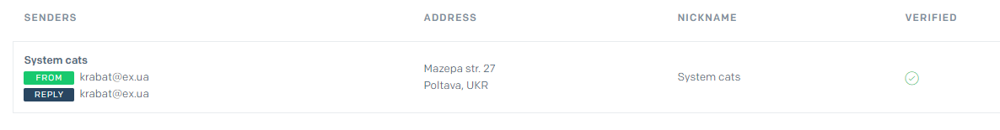
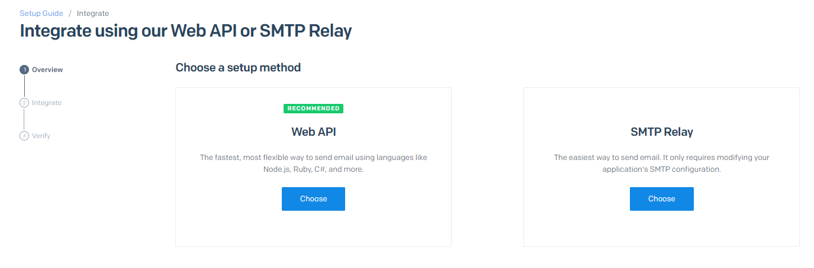
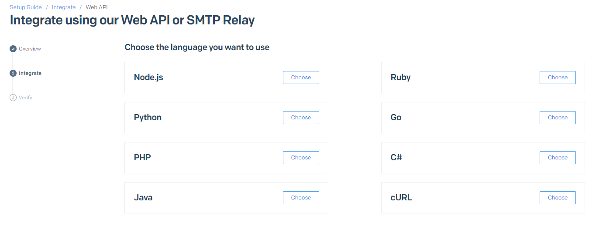
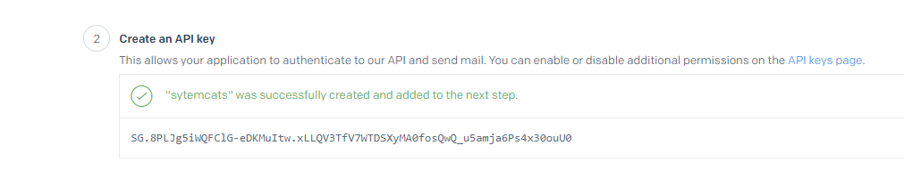

<h2>REST API used for working with a collection of contacts.</h2>

<h2>Commands:</h2>
<li><b>npm start</b> - server run in production mode;</li>
<li><b>npm run start:dev</b> - server run in development mode;</li>
<li><b>npm run lint</b> - run code check execution with the help of eslint; it should be done before each PR and fix all linter errors;</li>
<li><b>npm lint:fix</b> - the same linter check, but with automatic error-fixing;</li>
<li><b>npm test</b> - test launch in test environment;</li>
<li><b>npm test:coverage</b> - test report generation.</li>

<h2>Routes:</h2>
<h3>1. Contacts</h3>
<li><a href="http://localhost:3000/api/contacts" rel="noopener noreferrer" target="_blank">http://localhost:3000/api/contacts</a> - <b>/GET request/</b> - get all contacts;</li>
<li><a href="http://localhost:3000/api/contacts/id" rel="noopener noreferrer" target="_blank">http://localhost:3000/api/contacts/id</a> - <b>/GET request/</b> - get a contact by Id;</li>
<li><a href="http://localhost:3000/api/contacts" rel="noopener noreferrer" target="_blank">http://localhost:3000/api/contacts</a> - <b>/POST request/</b> - add a new contact (required fields: name, email, phone, optional field: favorite);</li>
<li><a href="http://localhost:3000/api/contacts/id" rel="noopener noreferrer" target="_blank">http://localhost:3000/api/contacts/id</a> - <b>/PUT request/</b> - update an existing contact (at least 1 field should be updated);</li>
<li><a href="http://localhost:3000/api/contacts/id" rel="noopener noreferrer" target="_blank">http://localhost:3000/api/contacts/id</a> - <b>/DELETE request/</b> - remove a contact;</li>
<li><a href="http://localhost:3000/api/contacts/id/favorite" rel="noopener noreferrer" target="_blank">http://localhost:3000/api/contacts/id/favorite</a> - <b>/PATCH request/</b> - update 'favorite' field for a contact.</li>

<h3>2. Users</h3>
<li><a href="http://localhost:3000/api/users/signup" rel="noopener noreferrer" target="_blank">http://localhost:3000/api/users/signup</a> - <b>/POST request/</b> - user registration;</li>
<li><a href="http://localhost:3000/api/users/login" rel="noopener noreferrer" target="_blank">http://localhost:3000/api/users/login</a> - <b>/POST request/</b> - user login;</li>
<li><a href="http://localhost:3000/api/users/logout" rel="noopener noreferrer" target="_blank">http://localhost:3000/api/users/logout</a> - <b>/POST request/</b> - user logout;</li>
<li><a href="http://localhost:3000/api/users/current" rel="noopener noreferrer" target="_blank">http://localhost:3000/api/users/current</a> - <b>/GET request/</b> - get user data by token;</li>
<li><a href="http://localhost:3000/api/users/subscription" rel="noopener noreferrer" target="_blank">http://localhost:3000/api/users/subscription</a> - <b>/PATCH request/</b> - update user subscription;</li>
<li><a href="http://localhost:3000/api/users/starter" rel="noopener noreferrer" target="_blank">http://localhost:3000/api/users/starter</a> - <b>/GET request/</b> - access by "starter" subscription;</li>
<li><a href="http://localhost:3000/api/users/pro" rel="noopener noreferrer" target="_blank">http://localhost:3000/api/users/pro</a> - <b>/GET request/</b> - access by "pro" subscription;</li>
<li><a href="http://localhost:3000/api/users/business" rel="noopener noreferrer" target="_blank">http://localhost:3000/api/users/business</a> - <b>/GET request/</b> - access by "business" subscription;</li>
<li><a href="http://localhost:3000/api/users/avatars" rel="noopener noreferrer" target="_blank">http://localhost:3000/api/users/avatars</a> - <b>/PATCH request/</b> - upload user avatar.</li>
<li><a href="http://localhost:3000/api/users/verify/:verificationTokens" rel="noopener noreferrer" target="_blank">http://localhost:3000/api/users/verify/:verificationTokens</a> - <b>/GET request/</b> - user search in user model by verificationToken parameter.</li>
<li><a href="http://localhost:3000/api/auth/verify/:verificationToken" rel="noopener noreferrer" target="_blank">http://localhost:3000/api/auth/verify/:verificationToken</a> - <b>/GET request/</b> - user verification request.</li>

<!-- # Домашнє завдання 6

Створи гілку `hw06-email` з гілки` master`.

Продовжуємо створення REST API для роботи з колекцією контактів. Додайте верифікацію email користувача після реєстрації за допомогою сервісу [SendGrid](https://sendgrid.com/).

## Як процес верифікації повинен працювати

1. Після реєстрації, користувач повинен отримати лист на вказану при реєстрації пошту з посиланням для верифікації свого email
2. Пройшовши посиланням в отриманому листі, в перший раз, користувач повинен отримати [Відповідь зі статусом 200](#verification-success-response), що буде мати на увазі успішну верифікацію email
3. Пройшовши по посиланню повторно користувач повинен отримати [Помилку зі статусом 404](#verification-user-not-found)

## Крок 1

### Підготовка інтеграції з SendGrid API

- Зареєструйся на [SendGrid](https://sendgrid.com/).
- Створи email-відправника. Для це в адміністративній панелі SendGrid зайдіть в меню Marketing в підміню senders і в правому верхньому куті натисніть кнопку "Create New Sender". Заповніть поля в запропонованій формі. Збережіть. Повинен вийде наступний як на картинці результат, тільки з вашим email:



На вказаний email повинно прийти лист верифікації (перевірте спам якщо не бачите листи). Натисніть на посилання в ньому і завершите процес. Результат повинен зміниться на:



- Тепер необхідно створити API токен доступу. Вибираємо меню "Email API", і підміню "Integration Guide". Тут вибираємо "Web API"



Далі необхідно вибрати технологію Node.js



На третьому кроці даємо ім'я нашого токені. Наприклад systemcats, натискаємо кнопку згенерувати і отримуємо результат як на скріншоті нижче. Необхідно скопіювати цей токен (це важливо, тому що більше ви не зможете його подивитися). Після завершити процес створення токена



- Отриманий API-токен треба додати в `.env` файл в нашому проекті

## Крок 2

### Створення ендпоінта для верифікації email

- додати в модель `User` два поля `verificationToken` і `verify`. Значення поля `verify` рівне `false` означатиме, що його email ще не пройшов верифікацію

```js
{
  verify: {
    type: Boolean,
    default: false,
  },
  verifyToken: {
    type: String,
    required: [true, 'Verify token is required'],
  },
}
```

- створити ендпоінт GET [`/users/verify/:verificationToken`](# verification-request), де по параметру `verificationToken` ми будемо шукати користувача в моделі `User`
- якщо користувач з таким токеном не знайдений, необхідно повернути [Помилку 'Not Found'](#verification-user-not-found)
- якщо користувач знайдений - встановлюємо `verificationToken` в `null`, а поле `verify` ставимо рівним` true` в документі користувача і повертаємо [Успішний відповідь](#verification-success-response)

### Verification request

```shell
GET /auth/verify/:verificationToken
```

### Verification user Not Found

```shell
Status: 404 Not Found
ResponseBody: {
  message: 'User not found'
}
```

### Verification success response

```shell
Status: 200 OK
ResponseBody: {
  message: 'Verification successful',
}
```

## Крок 3

### Додавання відправки email користувачу з посиланням для верифікації

При створення користувача при реєстрації:

- створити `verificationToken` для користувача і записати його в БД (для генерації токена використовуйте пакет [uuid](https://www.npmjs.com/package/uuid) або [nanoid](https://www.npmjs.com/package/nanoid))
- відправити email на пошту користувача і вказати посилання для верифікації email'а ( `/users/verify/:verificationToken`) в повідомленні
- Так само необхідно враховувати, що тепер логін користувача не дозволено, якщо не верифікувано email

## Крок 4

### Додавання повторної відправки email користувачу з посиланням для верифікації

Необхідно передбачити, варіант, що користувач може випадково видалити лист. Воно може не дійти з якоїсь причини до адресата. Наш сервіс відправки листів під час реєстрації видав помилку і т.д.

#### @ POST /users/verify

- Отримує `body` в форматі `{email}`
- Якщо в `body` немає обов'язкового поля `email`, повертає json з ключем `{"message":"missing required field email"}` і статусом `400`
- Якщо з `body` все добре, виконуємо повторну відправку листа з `verificationToken` на вказаний email, але тільки якщо користувач не верифікований
- Якщо користувач вже пройшов верифікацію відправити json з ключем `{"message":"Verification has already been passed"}` зі статусом `400 Bad Request`

#### Resending a email request

````shell
POST /users/verify
Content-Type: application/json
RequestBody: {
  "email": "example@example.com"
}
`` `

#### Resending a email validation error

```shell
Status: 400 Bad Request
Content-Type: application/json
ResponseBody: <Помилка від Joi або іншої бібліотеки валідації>
````

#### Resending a email success response

```shell
Status: 200 Ok
Content-Type: application/json
ResponseBody: {
  "message": "Verification email sent"
}
```

#### Resend email for verified user

```shell
Status: 400 Bad Request
Content-Type: application/json
ResponseBody: {
  message: "Verification has already been passed"
}
```

> Примітка: Як альтернативу SendGrid можна використовувати пакет [nodemailer](https://www.npmjs.com/package/nodemailer) -->


